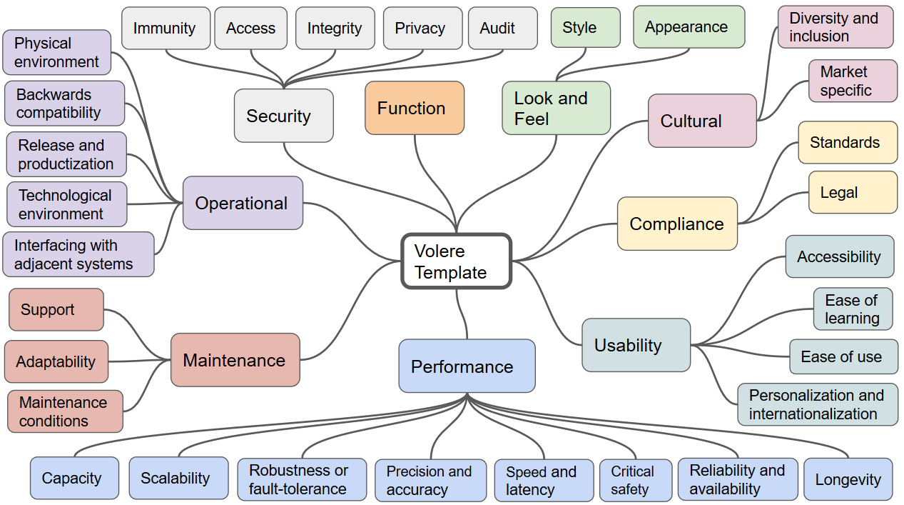

# Catalog of requirements for AI products

This is a catalog of requirements for AI products which aims to be as complete as possible. The purpose of the catalog is to help data science teams to collect all the requirements to consider while building a ML model and productionizing it.

Every forgotten requirement increases the likelihood that you will later have to rebuild part of your solution, or in the worst case rebuild it from scratch. This means wasting effort, not delivering on time, and losing the trust of your customers. 

Requirements engineering is a discipline which is established in the software development process. For software projects, there are also templates and checklists which help not to overlook any stakeholder or requirement. As we know, machine learning solutions have some particularities not present in other projects:

* everything related to the dataset
* experiment reproducibility
* ethical concerns
* context drift
* etc.

Thus, it would be nice to have a catalog of requirements for an AI solution. Everything I could find on the web contained only some of the questions you need to ask. So I created a new catalog aiming to be as complete as possible.

Important note: this catalog covers everything if used together with another catalog/template which includes requirements for the regular software system. Such catalogs have existed for a long time, so there’s no reason to duplicate this work. I recommend the Volere template ([free old version](http://homepages.laas.fr/kader/Robertson.pdf), [paid version](https://www.volere.org/templates/volere-requirements-specification-template/)), but you can also use another option. Here is the high level overview of Volere template:

The catalog presented here should close the gap by adding the machine learning-specific part to common software requirements.

How to use this catalog (and the Volere template) is generally up to the user. The approach which appears pragmatic to me is to go through questions when launching your DS project (for some requirements, a clarification in the course of the project may make more sense.) Try to find the answer to every question. Answers like “doesn’t matter in our context” are explicitly allowed. For the rest of the items, search for relevant stakeholders, ask them, and document what they tell you.

Requests for improvements to this catalog and changes are welcome – please either submit a pull request or open a GitHub issue.

## Problem

* What is the problem we want to solve?
* Which (strategic) business objective is it linked to?
* What are the current solutions/workarounds (if any)?
* Why do we think using machine learning will add value? (Links to similar cases in the industry, papers, research)
* Which parts of the system will use predictions? Which decisions/actions are possible based on the model’s predictions? Which user journey(s) include using the model, and what impact does it have?
* What input must the model accept, and what output does it have to produce?

## Metrics

* Which metric(s) will be used to measure the model’s performance?
* What is/are the minimal value(s) of metrics for running the model in production?
* How are the performance measures aligned with the business objectives?
* What is the performance of the current solution?
* Is there a way to estimate the value added by machine learning by using historical data?

## Dataset

* Any selection bias during data collection ? [(explanation)](https://en.wikipedia.org/wiki/Selection_bias)
* Are there missing values? If so:
    * Do you know the causes? 
    * Do they occur at random? [(explanation)](https://www.theanalysisfactor.com/missing-data-mechanism/)
* Are there any known issues with the correctness/accurateness of the data ?
* Where is data stored? Is it accessible from the infrastructure the DS team is using for training and serving?
* If data is structured or semi-structured: do you have documentation for each attribute?

## Ethics

* Could decisions your model makes discriminate against group of users?
* If so: what should be done
    * regarding the dataset?
    * regarding the feature engineering and modelling?
    * regarding the post-processing of decisions?

## Interpretation

Do we need to interpret the model from any of following points of view?

* Trust: show that model can make decisions previously made by humans
* Causality: find which predictors impact the target in which way
* Transferability: show that the model can predict reasonable results for different inputs, including ones not similar to the training samples
* Informativeness: if the model is created not for predictions but for measuring the impact of predictors, does it serve this goal?
* Fairness: show that the model is bias-free

## Legal and Regulatory Requirements

* When training the model, are there any restrictions regarding the preservation of user privacy?
* Any restrictions regarding the use of datasets for the defined purpose?
* Any restrictions regarding the modelling approach?
* Any regulations regarding the development process?

## Reproducibility

* What artifacts of your training do you want to keep or/and historize?
    * code and configurations
    * dataset
    * metrics
    * trained model
    * metadata (date, person who ran the experiment, software/hardware information, etc.)
* How will you achieve this?
* How will you avoid training/serving code skew? [(explanation)](https://towardsdatascience.com/training-serving-skew-77d947c4c100)

## Testability

* What checks and reports do we need for the dataset before building the model?
    * verifying correctness and completeness of data collection
    * discovering data drift [(explanation)](https://docs.microsoft.com/en-us/azure/machine-learning/how-to-monitor-datasets?tabs=python)
* What checks and reports do we need for the trained model?
    * regarding metrics
    * regarding differences to previous or other versions of the model
* Which grade of automation do we need for each of the defined checks/reports?
    * fully automated incl. decision whether to proceed in the pipeline or stop
    * half automated: generate relevant report, but leave the human to decide if to proceed
    * manually executed and decided by the human

## Model update

* Is any concept drift expected? [(explanation)](https://en.wikipedia.org/wiki/Concept_drift)
    * how often should a model be retrained/updated to mitigate it?
    * any other ideas for mitigation, e.g. post-processing
* How quickly must a change in source system be reflected in a new version of the model?

## Production

* What information will you record when making predictions?
* What metrics will you continuously watch in production? What thresholds and alerts will you set based on these metrics ?
* How will you discover a performance degradation in production?

